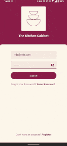
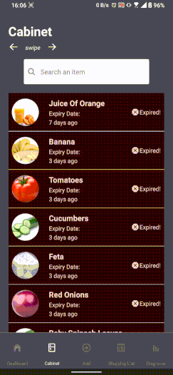
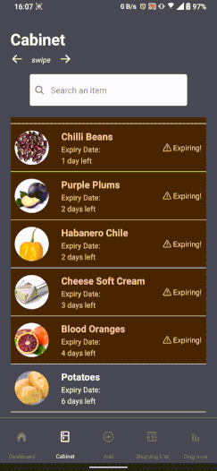
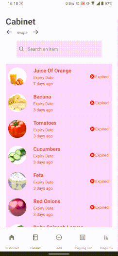

## About The Project

<h1 align="center">Kitchen Cabinet</h1>

check our <a href="https://github.com/YannWe/Kitchen-Cabinet-Backend" target="_blank">Backend</a>

<!-- TABLE OF CONTENTS -->

## Table of Contents

- [About](#about)
- [Features](#features)
- [Technologies](#technologies)
- [Team](#team)
- [Links](#links)

## About The Project

<h1 align="center">Kitchen Cabinet</h1>

check our <a href="https://github.com/YannWe/Kitchen-Cabinet-Backend" target="_blank">Backend</a>

<!-- TABLE OF CONTENTS -->

## Table of Contents

- [About](#about)
- [Features](#features)
- [Technologies](#technologies)
- [Team](#team)
- [Links](#links)

<!-- ABOUT -->

## Overview

This Project is our Final Project of the one year fullstack web developer course at [DCI Digital Career Institute gGmbH](https://digitalcareerinstitute.org/de/).

## About

- **Target users:**
  home chefs
- **Description:**
  Enable people to get the most for their food budget.
  Ingredient amounts bought in stores often exceed what people actually end up using, causing food to go to waste. The app will allow users to get the most out of what they have at home and making it easier to find recipes to
- **Use Cases:**

  What do users want to do in the app?

  - **Save their ingredients:** User wants to have a list of everything they have at home
  - **Find specific Recipes:** App can make it easier for users to find recipes OR be suggested recipes according to specific ingredients that they saved in the app.
  - **User specific requirements:** User are provided recipe suggestions according to their likes/dislikes/nutritional requirements etc.

<!-- FEATURES -->

## Features

**Login**

**Dashboard**

**Cabinet**

**Add Ingredients**

**Shopping List**

**Diagrams**

**Profile**

<!-- TECHNOLOGIES -->

## Technologies

### Front-end

&nbsp;&nbsp;

### Back-end

&nbsp;&nbsp;&nbsp;

<!-- TEAM -->

## Team

- [Aseel](https://github.com/aseelalmutareb)
- [Yannick](https://github.com/YannWe)
- [Franziska](https://github.com/loerk)

<!-- LINKS -->

## Links

- [Backend](https://github.com/YannWe/Kitchen-Cabinet-Backend)
- [Design?](<https://www.figma.com/file/ATMhtCX7NRp9otxh0y1EMy/Untitled-(Copy)?node-id=0%3A1>)
- [Github Project Page](https://github.com/users/YannWe/projects/1/views/1)

(<a href="#readme-top">back to top</a>)

### Try it out

[Android](https://expo.dev/artifacts/eas/nuN3qudDFgEVerUAK1etcy.apk)

(<a href="#readme-top">back to top</a>)

(<a href="#readme-top">back to top</a>)

